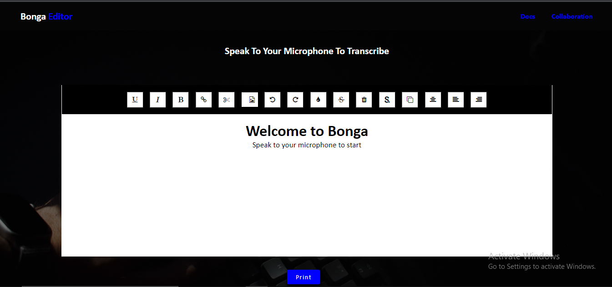

# Bonga Editor
Bonga is Swahili slang for speak/talk.
Bonga Editor is a JavaScript application that is primarily meant to turn speech into text in real time hence it can be used to write an article or produce transcripts while a podcast is running in the background.



## Installation
***
A little intro about the installation.
 
Use the package manager [npm](https://www.npmjs.com) to install Bonga.

```bash
$ git clone https://github.com/morehwachege/potential-memory.git
$ cd ../path/to/the/folder
$ npm install
$ npm start
```

## Usage
Start the server at port 3100

```powershell
node index.js
```

## Contributions & Collaborations
Pull requests are welcome. For major changes, please open an issue first to discuss what you would like to change.

Please make sure to update tests as appropriate.
### Guidelines
 * __Be informative__. Format your pull requests nicely. Include screenshots if applicable.
 * __Be a good citizen__. Try your best to adhere to the established styles of the project. This doesn't mean that you shouldn't break them, but be prepared to have a reason if you do.
 * Work in branches then send a PR. Just because you have commit access doesn't mean you shouldn't use pull requests. 
 * __Keep history clean__. No  ```--force```  pushing on branches that aren't yours.

## FAQs
***
Some questions & answers.
1. **What if I want to make a change, disagree with something, or have any other feedback?**
> Please don't hesitate to open an issue or pull request. You can also send me a message on Twitter. 

## Credits
These are credits to external resources and third party components used in this project, with due credits to their authors and license terms. 
* [Deepgram API](https://deepgram.com)

## License
[ISC](https://choosealicense.com/licenses/isc/)
